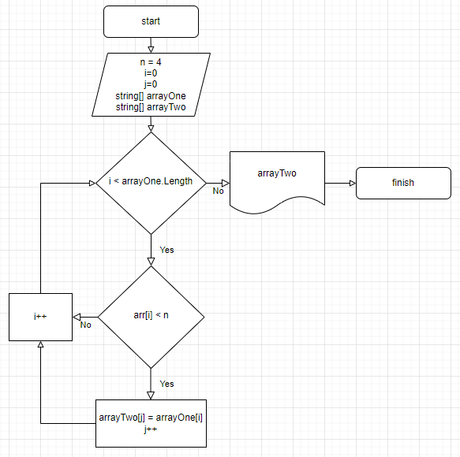

  # Итоговая работа 
  ## Задача:
  Написать программу, которая из имеющегося массива строк формирует новый массив из строк, длина которых меньше, либо равна 3 символам. Первоначальный массив можно ввести с клавиатуры, либо задать на старте выполнения алгоритма. При решении не рекомендуется пользоваться коллекциями, лучше обойтись исключительно массивами.

 __Примеры:___ - _[“Hello”, “2”, “world”, “:-)”] → [“2”, “:-)”]_
  ## Алгоритм решения:
1.  _Содаем и заполняем строковый массив рандомными занчениями._
    
2.  _Определяем количество элементов в данном массиве, длина которых меньше четырёх символов. Это количество будет определять размер нового массива для переноса элементов._
3.  _Создаем новый массив определённой ранее длины, заполняем его значениями по тому же условию(длина элементов элементов из начлаьного массива меньше четырёх символов)_
4. _Выводим результаты переноса элементов из первоначального строкового массива в новый строковый массив, согласно условию задачи._
    

## Добавили блок-схему алгоритма решения задачи.

